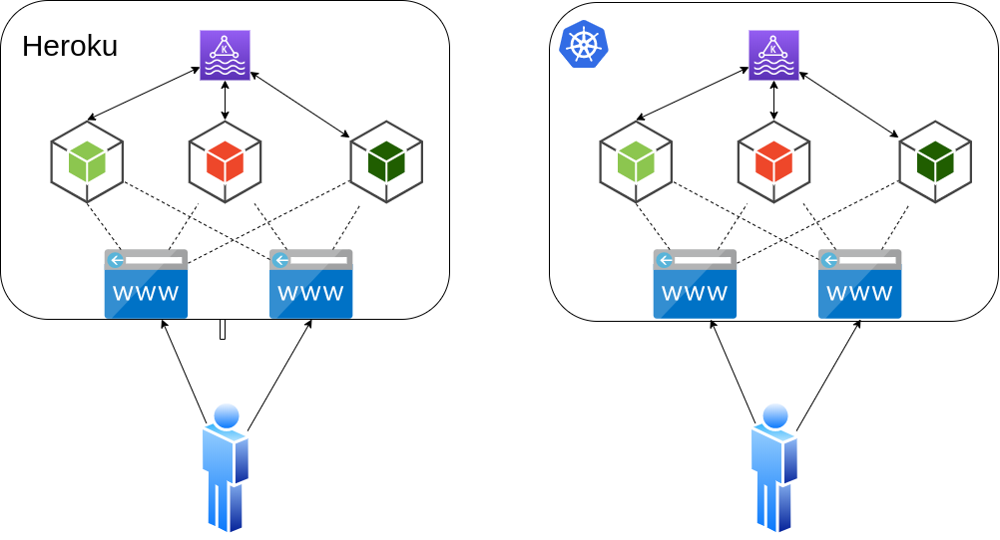
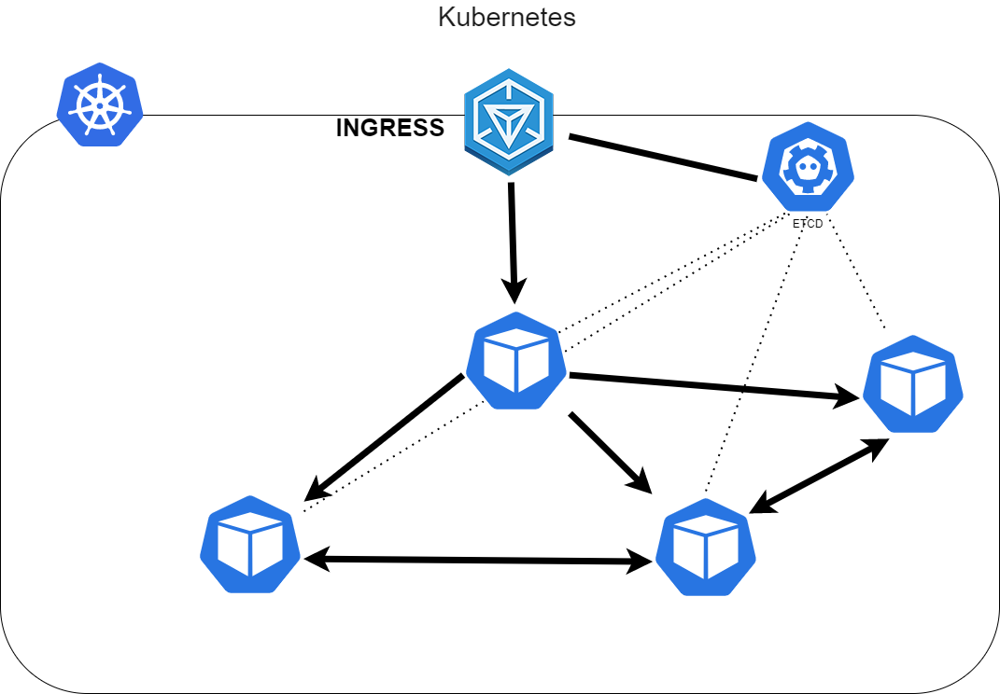

## Infraestrutura
Aws Ec2 instance (Verificar demanda) - Ubuntu Server 20 | CentOS 8

O tipo de instância escolhido vai depender da carga que o servidor vai receber, isso ainda será definido. 
Um exemplo de cotação recente na AWS e que atende a um projeto significativamente "pesado" é um Cluster composto por 3 instâncias do tipo t3a.xlarge 4-Core, 16 GB de RAM e 50 GB de disco cada, o valor das 3 instâncias ficou em aproximadamente 300 Dólares mensais.

## Software

Kubernetes em cluster com 3 nós, sendo dois operando com todos os serviços do Kubernetes e um rodando como Worker.

Criação de Dockerfile para criação das imagens.

Criar e gerenciar um repositório privado no DockerHub ou implementar um registry privado.

## Estrutura do Kubernetes

